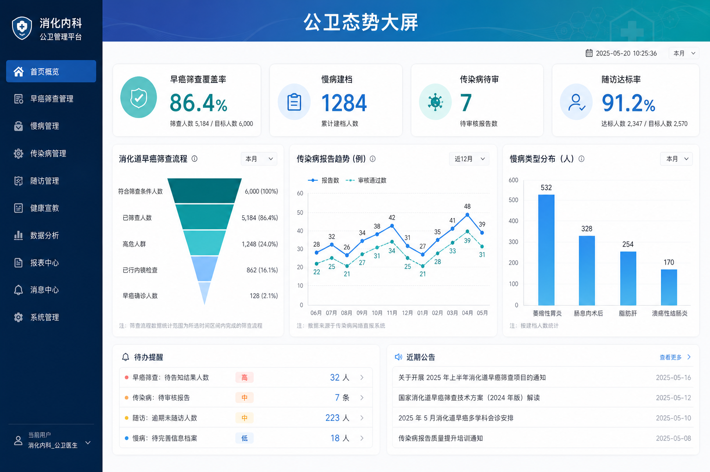

# 山东第一医科大学附属消化病医院公共卫生管理信息平台系统

- **生产环境 Host**: [https://26-sd-phm-bid.softwarelink.net/](https://26-sd-phm-bid.softwarelink.net/)
- **代码仓库 Repo**: [https://github.com/softwarelink-net/26-sd-phm-bid](https://github.com/softwarelink-net/26-sd-phm-bid)

---

## 控制台预览



---

## 部署与运行说明

### 1. 环境要求
- Node.js >= 18.x
- pnpm >= 8.x 或 npm >= 9.x
- Cloudflare Wrangler CLI >= 3.x

### 2. 安装依赖
```bash
pnpm install
```

### 3. 本地运行
```bash
# 启动前端本地开发服务器
pnpm run dev

# 启动本地 Worker 调试（连接本地/远程 D1）
pnpm run dev:worker
```

### 4. 演示账号
| 角色 | 用户名 | 密码 | 权限说明 |
| :--- | :--- | :--- | :--- |
| 超级管理员 | `admin@sdphm.cn` | `Admin@2026!` | 拥有系统全部模块的最高管理权限 |
| 公卫科主任 | `director@sdphm.cn` | `Director@2026!` | 负责公卫审核、传染病直报、随访监管 |
| 临床医生 | `doctor@sdphm.cn` | `Doctor@2026!` | 门诊/住院慢病录入、阳性指征初审 |
| 随访护士 | `nurse@sdphm.cn` | `Nurse@2026!` | 负责执行随访任务及履约记录回填 |

### 5. 生产构建
```bash
pnpm run build
```

### 6. 部署到 Cloudflare
本系统采用 Cloudflare Workers 架构部署（Worker 名称：`allworld`，静态资源存入共享存储桶 `allworld-sites/26-sd-phm-bid/`）：
```bash
# 1. 构建前端生产产物
pnpm run build

# 2. 上传静态资产至 R2 对应路径
wrangler r2 object put 26-sd-phm-bid-assets/dist --file=./dist --recursive

# 3. 部署共享 Worker
wrangler deploy --name allworld
```

### 7. 常用脚本一览
- `pnpm run dev`：启动前端 Vite 开发服务器。
- `pnpm run build`：生产环境编译与打包。
- `pnpm run preview`：本地预览构建后产物。
- `pnpm run db:migrate`：执行 D1 数据库迁移脚本。
- `pnpm run db:seed`：注入系统初始种子数据。

### 8. 目录结构
```text
26-sd-phm-bid/
├── docs/
│   └── assets/                  # 项目预览图及架构设计图
├── src/
│   ├── api/                     # 后端 API 请求封装
│   ├── assets/                  # 静态资源文件
│   ├── components/              # 全局通用 UI 组件
│   │   ├── TopBanner.vue        # 顶部不可收起 Fixed Banner
│   │   └── ...
│   ├── layouts/
│   │   ├── AuthLayout.vue       # 认证界面布局
│   │   └── MainLayout.vue       # 主后台管理布局
│   ├── router/                  # 路由配置与全局路由守卫
│   ├── stores/                  # Pinia 状态管理 (Auth, Permission, App)
│   ├── views/                   # 各核心业务模块视图
│   ├── App.vue                  # 根组件 (注入 TopBanner)
│   └── main.js                  # 应用入口配置
├── worker/
│   ├── index.js                 # Cloudflare Worker 共享入口路由
│   ├── schema.sql               # D1 关系型数据库建表与种子脚本
│   └── controllers/             # Worker RESTful 控制器
├── wrangler.toml                # Wrangler 配置文件
├── tailwind.config.js           # Tailwind CSS 配置文件
├── vite.config.js               # Vite 构建配置
└── README.md                    # 本文档
```

---

## 招标公告全文

*   **标题**：山东第一医科大学附属消化病医院公共卫生管理信息平台系统购置项目（61201）竞争性磋商公告
*   **项目发包方**：山东第一医科大学附属消化病医院
*   **项目编号**：SDGP370000000202602007491
*   **项目发布时间**：2026-08-14 23:24:00
*   **关键词**：山东第一医科大学附属消化病医院, 公共卫生管理信息平台, 公卫管理系统, SDGP370000000202602007491, 医疗信息化采购, 竞争性磋商, 山东政府采购
*   **摘要**：山东第一医科大学附属消化病医院委托山东三木招标有限公司，就公共卫生管理信息平台系统购置项目（61201）组织竞争性磋商，采购预算及最高限价为 100,000.00 元，采购内容为 1 套公卫管理信息平台软件，合同履行期限为签订后 60 日历天内完成实施上线并进入试运行，响应文件提交截止时间为 2026 年 8 月 25 日 09:00。
*   **技术要点**：
    1. 专病与公卫档案一体化：实现慢性胃炎、消化道息肉、肝病等专科慢病建档、风险评级与动态追踪；
    2. 传染病网报智能预警：集成消化系统传染病（病毒性肝炎等）的检验阳性自动截获与直报工作流；
    3. 全流程随访履约引擎：消化道早癌筛查后精准随访队列管理与多端随访任务调度；
    4. 医疗级安全与脱敏：严格遵循 RBAC 权限与敏感健康信息（PHI）字段级动态脱敏。
*   **技术创新性**：
    1. 边缘无服务器轻量架构（Cloudflare Workers + D1），极大降低医院信息化采购与长期运维成本；
    2. 专科-公卫联动规则引擎，打破传统 HIS/LIS 与公共卫生直报之间的孤岛隔阂；
    3. 响应式医疗级 UI/UX 设计，结合高效的列级数据脱敏与不可篡改审计追踪机制。

---

## 免责声明

1. **数据来源与合规性**：本系统展示的所有招标信息、项目背景及采购需求均来源于公开招投标平台（如中国招标投标公共服务平台、中国建设银行龙集采平台等）。系统仅用于技术方案演示、架构原型验证与演示搭建，不涉及任何商业非法抓取或数据篡改。
2. **技术实现路径**：本系统前端基于 Vue 3 + Tailwind CSS 构建，后端基于 Cloudflare Workers 极简无服务器架构，数据存储采用 Cloudflare D1 关系型数据库，完整符合分布式高可用与银企对接安全标准。
3. **保密承诺**：开发团队严格遵守保密义务，系统内示例数据均经过伪化脱敏处理（Anonymized），不包含真实患者医疗健康信息（PHI）或建行敏感金融交易数据。
4. **知识产权与巧合声明**：本系统中涉及的商标、机构名称（中国建设银行、川北医学院附属医院等）归各自合法持有人所有。演示代码与系统架构若与实际投产系统存在相似之处，纯属技术通用设计之巧合。
5. **免责条款**：本演示系统不具备实际金融扣款功能，不承担因非授权使用、不可抗力或第三方平台接口变更所导致的任何法律责任与经济损失。
